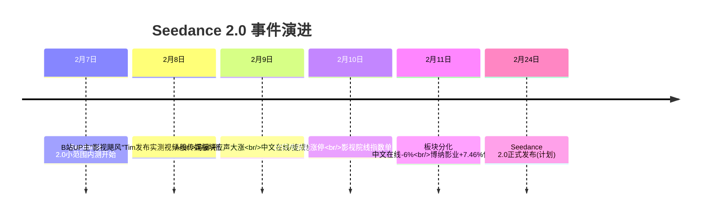
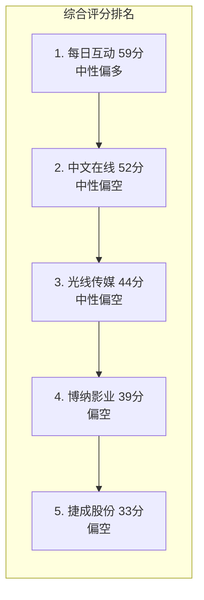
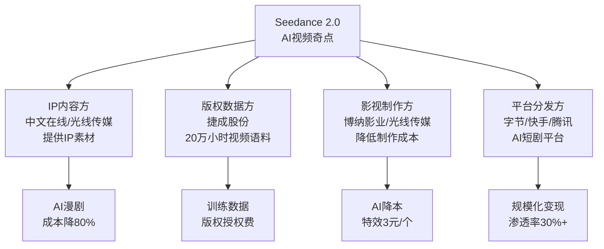
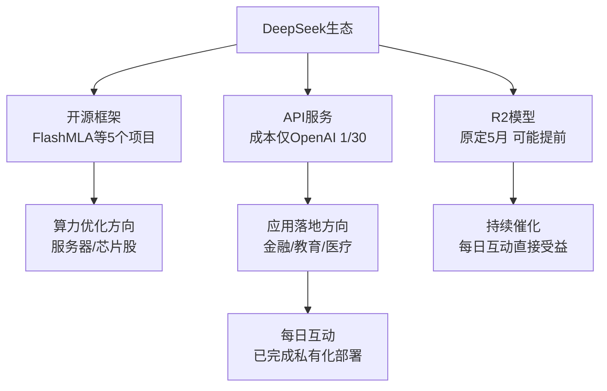
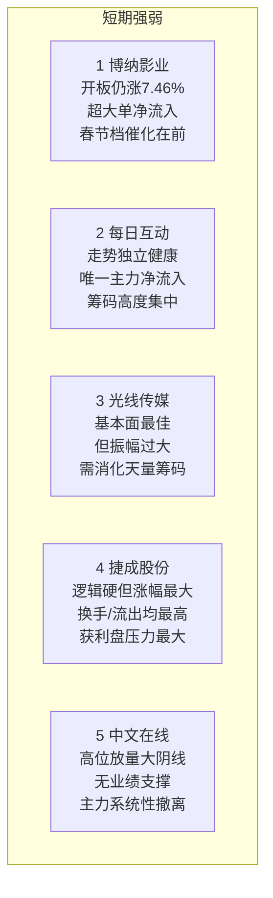
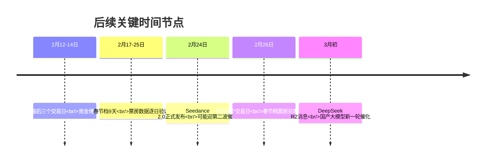

# 五股深度分析报告

> **日期**：2026年2月11日（周三）  
> **标的**：中文在线(SZ300364)、博纳影业(SZ001330)、光线传媒(SZ300251)、捷成股份(SZ300182)、每日互动(SZ300766)  
> **数据来源**：MCP实时行情 + baostock历史K线 + 网络新闻

---

## 一、市场热点与核心催化

### 1.1 Seedance 2.0 — AI视频的"奇点时刻"

**事件时间线**：

**技术突破**：

Seedance 2.0采用**双分支扩散变换器架构**，四大关键能力突破：

| 能力 | 描述 | 行业意义 |
|------|------|---------|
| 自运镜/分运镜 | 根据情节自动规划镜头切换 | 取代真人导演部分工作 |
| 全方位多模态 | 接收文本/图片/视频/音频组合输入 | 降低创作门槛 |
| 音画同步生成 | 原生对白、音效、配乐同步 | 一站式出片 |
| 多镜头叙事 | 角色一致性+场景连贯性 | 解决AI视频核心痛点 |

**成本革命**：

| 品类 | 传统成本 | AI成本 | 降幅 |
|------|---------|--------|------|
| 仿真人短剧(部) | 1-3万元 | 2000-4000元 | 60-85% |
| AI漫剧(部) | 30-120万元 | 5-15万元 | 80% |
| 特效镜头(个) | 3000元+1个月 | 3元+2分钟 | 99.9% |

**市场预测**：2026年AI短剧渗透率有望达30-35%，AI漫剧市场规模189.8亿元（同比+276%）。

**风险点**：Tim发现个人视频素材被纳入训练集，引发版权争议。字节已限制真人素材作为主体参考，要求活体认证。

### 1.2 DeepSeek与国产大模型密集发布

**"春节AI竞赛"格局**：

| 厂商 | 产品 | 发布时间 | 亮点 |
|------|------|---------|------|
| 百度 | 文心大模型5.0 | 1月22日 | 2.4万亿参数，40余项评测超GPT-5 |
| 阿里 | Qwen3-Max-Thinking | 1月底 | 1万亿参数，媲美GPT-5.2 |
| 月之暗面 | Kimi K2.5 | 1月27日 | 原生多模态，已开源 |
| 腾讯 | 混元图像3.0 | 1月底 | MoE架构80B参数 |
| 字节跳动 | Seedance 2.0 | 2月7日内测 | 导演级AI视频生成 |
| 快手 | 可灵3.0 | 1月31日 | All-in-One多模态引擎 |
| DeepSeek | R2(预期) | 原定5月，可能提前 | 编程能力+多语言推理大幅提升 |

**DeepSeek核心进展**：

- **开源周**已发布5个代码库：FlashMLA（推理3000GB/s）、DeepGEMM、DeepEP、DualPipe、3FS
- API调用成本仅为OpenAI o1的**1/30**
- 日活用户突破4000万
- R2模型有望提前发布，市场预期持续发酵

**行业转向**：从"参数竞赛"→"工程优化"，从"实验室Demo"→"规模化服务"。资本重心转向商业确定性。

### 1.3 春节档叠加

2026年春节档（2月17-25日）为史上最长**9天**。预售已破亿，《飞驰人生3》领跑。博纳影业为《飞驰人生3》联合出品方。

---

## 二、五股2月11日核心数据速览

| 指标 | 中文在线 | 博纳影业 | 光线传媒 | 捷成股份 | 每日互动 |
|------|---------|---------|---------|---------|---------|
| **收盘价** | 39.80 | 13.40 | 26.86 | 8.85 | 48.60 |
| **今日涨跌** | **-6.00%** | **+7.46%** | **+5.09%** | **+4.73%** | **+2.75%** |
| **5日涨幅** | +29.35% | +32.94% | +28.89% | +47.50% | +15.52% |
| **20日涨幅** | +10.71% | +49.89% | +51.49% | +33.48% | +5.88% |
| **成交额(亿)** | 105.04 | 59.29 | 138.83 | 106.72 | 31.29 |
| **换手率** | 35.71% | 31.91% | 17.76% | 45.58% | 16.67% |
| **主力资金** | 流出10.27亿 | 流出1.32亿 | 流出9.38亿 | 流出12.13亿 | **流入0.36亿** |
| **超大单** | 流出11.22亿 | **流入2.50亿** | 流出9.76亿 | 流出12.82亿 | 0 |
| **市盈率** | -119 | -21 | 270 | 98 | -296 |
| **市净率** | 61.33 | 4.40 | 7.33 | 2.79 | 12.22 |

---

## 三、个股深度分析

### 3.1 中文在线（SZ300364）— AI语料龙头，高位巨量见顶信号

#### 概念属性

AIGC概念、AI语料、DeepSeek概念、IP经济、短剧游戏、数据要素、字节概念

#### 公司AI布局

- 与快手可灵AI深度合作，推动IP向视频化演进
- 自研"逍遥AI"工具链，融入可灵、即梦等模型
- 推出"次元神笔"AI漫剧制作工具
- 首批发布AIGC数据版权倡议书

#### 近5日30分钟K线走势

| 日期 | 开盘 | 收盘 | 涨跌 | 成交额 | 走势特征 |
|------|------|------|------|--------|---------|
| 2/5 | 30.55 | 30.77 | +0.72% | 18.6亿 | 早盘冲高31.95后全天回落，上午量占72% |
| 2/6 | 30.13 | 29.40 | -2.42% | 16.1亿 | 低开低走，尾盘加速下跌至29.37 |
| 2/9 | 35.28 | 35.28 | **一字涨停** | 18.2亿 | Seedance催化，竞价直接封死，上午量占97% |
| 2/10 | 42.32 | 42.34 | **20cm涨停** | 95.5亿 | 开盘冲高后砸至38.93(-8%)，随后逐步回封 |
| 2/11 | 42.50 | 39.80 | **-6.00%** | 105.0亿 | 高开后持续下行，振幅12.45%，天量105亿 |

**分时资金承接分析**：

- **2/10关键信号**：开盘后从42.32暴跌至38.93（回落8%），上午前30分钟成交14250万手（占全天60%），说明大量获利盘在开盘集中兑现。随后用了2小时拉回封板——这是**主力对倒拉升**的典型特征，而非自然买盘推动
- **2/11确认分歧**：成交105亿（为5日均额的2倍），换手35.71%。主力净流出10.27亿，超大单流出11.22亿。这意味着**大资金在系统性撤离**，散户和中小单在接盘

#### 技术指标

| 指标 | 数值 | 信号 |
|------|------|------|
| MA5/10/20/60 | 35.52/33.56/31.72/28.54 | 均线多头但股价远离MA5 |
| MACD | DIF=2.07 > DEA=1.39 | 金叉，柱放大 |
| KDJ | K=65.9 D=48.5 **J=100.7** | J值超买区 |
| RSI(6/12/24) | 69.2/66.0/63.2 | RSI6从82回落至69 |
| 布林带 | 上轨44.75/中轨34.75 | 股价在带内104%处 |
| ATR(14) | 2.92 | 日均波动7.3% |

**综合评分：52/100** — 中性偏空

#### 基本面警示

| 年份 | 营收(亿) | 净利润(亿) | ROE |
|------|---------|-----------|-----|
| 2024 | 11.59 | **-2.43** | -24.65% |
| 2023 | 14.09 | 0.89 | 7.18% |
| 2022 | 11.80 | **-3.62** | -31.38% |

- 预计2025年亏损5.8-7亿元（同比扩大139-188%）
- 资产负债率从37.86%升至66.56%
- 海外短剧销售费用6.6亿（同比+93.65%），烧钱模式
- 市净率61倍——**纯概念炒作，无业绩支撑**

#### 预测与关键价位

| 价位类型 | 价格 | 依据 |
|---------|------|------|
| 短期压力 | 42.34 | 2/10涨停价 |
| 第一支撑 | 35.52 | MA5 |
| 第二支撑 | 33.56 | MA10 |
| ATR止损 | 33.86 | 当前价-2倍ATR |

**判断**：2/11高位放量大阴线是**典型见顶信号**。35.71%换手+主力净流出10亿，筹码极度松动。短期大概率继续调整，目标MA5(35.5)附近。除非出现新的强催化（如Seedance 2.0正式发布2/24），否则高位震荡回落为主。**短线回避**。

---

### 3.2 博纳影业（SZ001330）— 春节档+Seedance双催化，连板后最强

#### 概念属性

文化传媒概念、AIGC概念、字节概念、短剧游戏、腾讯概念、阿里概念

#### 核心催化

- **春节档**：联合出品《飞驰人生3》，该IP前两部累计票房50亿+，猫眼想看人数突破70万
- **Seedance**：作为正宗影视公司，AI降本逻辑直接受益

#### 近5日30分钟K线走势

| 日期 | 开盘 | 收盘 | 涨跌 | 成交额 | 走势特征 |
|------|------|------|------|--------|---------|
| 2/5 | 9.27 | 10.08 | +8.74% | 16.3亿 | 低开高走V形反弹，尾盘拉升至10.08 |
| 2/6 | 10.00 | 10.31 | +3.10% | 18.4亿 | 早盘跳水至9.42后午后资金强势拉回 |
| 2/9 | 11.34 | 11.34 | **一字涨停** | 20.3亿 | 竞价封死，仅开盘瞬间微跌至10.99 |
| 2/10 | 12.30 | 12.47 | **一字涨停** | 10.2亿 | 竞价直封，成交极低仅10亿（缩量封板） |
| 2/11 | 12.94 | 13.40 | **+7.46%** | 59.3亿 | 开板后仍大涨，超大单净流入2.50亿 |

**分时资金承接分析**：

- **2/6的V形反弹极为关键**：早盘从10.00跳水至9.42(-5.8%)，但午后13:30-14:00期间主力强势拉回，午后量占48%（五只中午后占比最高）。这说明**有资金在下跌时主动承接**
- **2/9-2/10连续缩量一字板**：2/10成交仅10.2亿，说明筹码高度锁定，卖盘极少
- **2/11开板表现**：虽然开板，但收盘仍涨7.46%，且**超大单净流入2.50亿**（五只中唯一超大单净流入）。主力净流出仅1.32亿，远小于其他四只

#### 技术指标

| 指标 | 数值 | 信号 |
|------|------|------|
| MA5/10/20/60 | 11.52/10.65/9.23/8.98 | **完美多头排列** |
| MACD | DIF=0.87 > DEA=0.50 | 金叉加速放大 |
| KDJ | K=86.6 D=77.5 **J=104.9** | 超买但趋势强 |
| RSI(6/12/24) | 87.2/77.9/69.0 | 短期超买 |
| 布林带 | 上轨13.83/中轨11.30 | 突破上轨，强势延续 |
| ATR(14) | 0.83 | 日均波动6.2% |

**综合评分：39/100** — 偏空（主因5日涨幅42%触发最大减分）

> 注：评分模型对短期涨幅过大给予强惩罚。但从资金结构看，博纳是五只中**最健康的**。

#### 基本面

| 年份 | 营收(亿) | 净利润(亿) | ROE |
|------|---------|-----------|-----|
| 2024 | 14.61 | **-8.67** | -16.42% |
| 2023 | 16.08 | **-5.53** | -8.90% |
| 2022 | 20.12 | **-0.76** | -1.11% |

- 连续三年亏损，基本面在五只中最差
- 但市净率仅4.40（五只中最低），估值有安全垫
- 核心看点在于春节档票房能否扭转预期

#### 预测与关键价位

| 价位类型 | 价格 | 依据 |
|---------|------|------|
| 短期压力 | 13.72 | 2/11日内最高 |
| 第一支撑 | 12.47 | 2/10涨停价 |
| 第二支撑 | 11.34 | 2/9涨停价 |
| ATR止损 | 11.66 | 当前价-2倍ATR |

**判断**：五只中**今日最强**。超大单净流入+开板后仍大涨，说明主力仍看好。核心催化在春节档（2/17-25）：若《飞驰人生3》票房超预期，节后有二次上攻空间。但连续三板后短期回调概率大，**12.5元附近若能站稳，中线可关注**。

---

### 3.3 光线传媒（SZ300251）— IP储备最强，基本面最扎实

#### 概念属性

AIGC概念、IP经济、虚拟数字人、虚拟现实、阿里概念、英伟达概念

#### 核心优势

- **五只中唯一连续盈利**：2024年净利2.92亿、2023年4.18亿
- IP储备丰厚：《大鱼海棠》《哪吒》等系列
- AIGC+IP变现的商业闭环最清晰

#### 近5日30分钟K线走势

| 日期 | 开盘 | 收盘 | 涨跌 | 成交额 | 走势特征 |
|------|------|------|------|--------|---------|
| 2/5 | 19.60 | 20.15 | +2.6% | ~25亿 | 温和上涨，分时均匀放量 |
| 2/6 | 20.04 | 20.40 | +1.8% | ~25亿 | 稳步攀升，无剧烈波动 |
| 2/9 | ~21.0 | 21.30 | +4.4% | ~30亿 | Seedance催化，大幅上涨但未涨停 |
| 2/10 | ~24.0 | 25.56 | **20cm涨停** | ~80亿 | 开盘冲高后封板 |
| 2/11 | 24.56 | 26.86 | **+5.09%** | 138.8亿 | 振幅21.66%!盘中冲29.88后回落 |

**分时资金承接分析**：

- **2/11振幅21.66%是五只之最**：最高29.88（距30元一步之遥）→最低24.56（跌破昨日涨停价25.56）→收盘26.86。这种"冲高-暴跌-拉回"的走势说明多空**极度分歧**
- 成交额138.83亿为**全场最大**（流通市值约800亿）
- 主力流出9.38亿，超大单流出9.76亿——大资金在高位兑现
- 但最终收涨5.09%，说明下跌时仍有资金承接

#### 技术指标

| 指标 | 数值 | 信号 |
|------|------|------|
| MA5/10/20/60 | 23.00/21.17/18.60/17.44 | **完美多头排列** |
| MACD | DIF=1.80 > DEA=1.02 | 金叉强势放大 |
| KDJ | K=84.3 D=81.4 J=90.3 | 高位超买 |
| RSI(6/12/24) | **90.9/86.5/80.4** | **全面极度超买** |
| 布林带 | 上轨27.85/中轨22.52 | 突破上轨119% |
| ATR(14) | 1.49 | 日均波动5.5% |

**综合评分：44/100** — 中性偏空

#### 基本面（五只最佳）

| 年份 | 营收(亿) | 净利润(亿) | ROE |
|------|---------|-----------|-----|
| 2024 | 15.86 | **2.92** | 3.33% |
| 2023 | 15.46 | **4.18** | 4.81% |
| 2022 | 7.55 | -7.13 | -8.63% |

- 市盈率270倍（偏高，反映IP变现高预期）
- 净资产收益率21.73%（当前滚动，五只最高）
- AI赋能IP开发逻辑最清晰、最有商业确定性

#### 预测与关键价位

| 价位类型 | 价格 | 依据 |
|---------|------|------|
| 短期压力 | 29.88 | 2/11日内最高 |
| 心理关口 | 30.00 | 整数关口 |
| 第一支撑 | 25.56 | 2/10涨停价 |
| 第二支撑 | 23.00 | MA5 |
| ATR止损 | 23.40 | 当前价-2倍ATR |

**判断**：RSI(12)=86.5是五只中最高——不仅短期超买，**中期也极度超买**。139亿天量需要时间消化。但光线是五只中**中线逻辑最硬的**（真实盈利+IP储备+AI赋能）。**短期回调至23-25元区间是较好的中线布局时机**。

---

### 3.4 捷成股份（SZ300182）— Sora概念+版权库龙头，涨幅最大风险最高

#### 概念属性

AI语料、Sora概念、DeepSeek概念、AIGC、华为概念、IP经济、短剧游戏

#### 核心逻辑

- **影视版权库龙头**：20万小时影视视听素材，是AI视频训练的天然语料供给方
- 与华为云签署视频大模型合作协议
- ChatPV 3.0已集成DeepSeek，实现"一键成片"
- Seedance/Sora概念最直接受益方——AI视频模型训练需要版权素材

#### 近5日30分钟K线走势

| 日期 | 开盘 | 收盘 | 涨跌 | 成交额 | 走势特征 |
|------|------|------|------|--------|---------|
| 2/5 | 5.92 | 6.00 | +1.35% | 6.6亿 | 窄幅震荡，量能低迷 |
| 2/6 | 5.92 | 5.87 | -0.84% | 6.5亿 | 尾盘下跌，成交清淡 |
| 2/9 | 6.43 | 7.04 | **20cm涨停** | 35.9亿 | 开盘放量冲板，上午量占96.6% |
| 2/10 | 8.00 | 8.45 | **20cm涨停** | 37.4亿 | 竞价直接封死，封板后量极低 |
| 2/11 | 8.30 | 8.85 | **+4.73%** | 106.7亿 | 冲高9.46后回落，换手45.58% |

**分时资金承接分析**：

- **2/9的爆发**：从6.43起步，开盘30分钟成交35325万手（占全天67%），开盘即放量抢筹。上午量占96.6%，典型的**主力早盘集中建仓封板**
- **2/10缩量封板**：竞价直封，全天37.4亿，其中开盘一根K就占44136万手（98.5%上午量）。筹码极度锁定
- **2/11风险暴露**：换手45.58%为**五只之最**——意味着几乎所有流通筹码都交易了一遍。主力流出12.13亿、超大单流出12.82亿，均为**五只之最**

#### 技术指标

| 指标 | 数值 | 信号 |
|------|------|------|
| MA5/10/20/60 | 7.24/6.64/6.25/5.91 | **完美多头排列** |
| MACD | DIF=0.45 > DEA=0.19 | 金叉放大 |
| KDJ | K=74.7 D=59.6 **J=104.9** | 超买 |
| RSI(6/12/24) | **90.9/83.7/75.9** | RSI6极度超买 |
| 布林带 | 上轨9.46/中轨7.01 | 突破上轨125% |
| ATR(14) | 0.45 | 日均波动5.1% |

**综合评分：33/100** — 偏空（五只最低）

#### 基本面

| 年份 | 营收(亿) | 净利润(亿) | ROE |
|------|---------|-----------|-----|
| 2024 | 28.66 | 2.38 | 2.90% |
| 2023 | 28.00 | 4.50 | 5.67% |
| 2022 | 39.07 | 5.21 | 7.05% |

- 有盈利但2024年利润下滑47%
- 市盈率98倍，市净率2.79（五只中最低PB）
- "AI语料+版权库"逻辑硬，但短期透支严重

#### 预测与关键价位

| 价位类型 | 价格 | 依据 |
|---------|------|------|
| 短期压力 | 9.46 | 2/11日内最高 |
| 第一支撑 | 8.45 | 2/10涨停价 |
| 第二支撑 | 7.04 | 2/9涨停价 |
| ATR止损 | 7.92 | 当前价-2倍ATR |

**判断**：5日涨幅48.5%为五只之最，换手45.6%为五只之最，主力流出12.1亿为五只之最——**短期透支最严重**。高位追入风险极大。如果Seedance 2.0在2/24正式发布带来新催化，可能还有脉冲；否则短期大概率回调至7-8元区间消化获利盘。**短线应回避，中线关注7元附近支撑**。

---

### 3.5 每日互动（SZ300766）— DeepSeek+大数据，独立于传媒主线

#### 概念属性

DeepSeek概念、AI语料、大数据、数据要素、云计算、华为概念、鸿蒙概念

#### 核心逻辑（与其他四只不同）

- **主营大数据服务**，非传媒股。驱动逻辑是"DeepSeek+数据智能"
- 已完成DeepSeek私有化部署，用于业务垂直场景和研发提效
- 2月5日因DeepSeek概念20%涨停
- 与传媒板块走势**相对独立**

#### 近5日30分钟K线走势

| 日期 | 开盘 | 收盘 | 涨跌 | 成交额 | 走势特征 |
|------|------|------|------|--------|---------|
| 2/5 | 40.78 | 42.07 | +3.16% | 13.1亿 | 上午量占75%，走势平稳 |
| 2/6 | 41.35 | 43.24 | +4.57% | 18.1亿 | 午盘拉升至44.49，上午量仅占66%（有午后买入） |
| 2/9 | 44.22 | 45.61 | +3.14% | 26.7亿 | **午后比上午活跃**（上午55%/午后45%） |
| 2/10 | 45.62 | 47.30 | +3.68% | 37.5亿 | 午盘11:30拉升至47.43，午后冲49.61后回落 |
| 2/11 | 47.00 | 48.60 | +2.75% | 31.3亿 | 冲49.23后温和回落，走势最平稳 |

**分时资金承接分析**：

- **午后买入意愿强**：2/9上午仅占55%、2/10上午仅占49%——这在传媒概念股中极为罕见（其他四只上午量均占65%+）。说明不是竞价抢筹的游资模式，而是**机构在午后分批建仓**
- **唯一主力净流入0.36亿**：虽然金额不大，但在其他四只都是大幅流出的背景下，这个信号非常珍贵
- **量比仅1.23x**（其他四只都在2-4.5x），成交温和有序
- **筹码离散度仅4.1%**（其他四只9-14%），**高度集中**

#### 技术指标

| 指标 | 数值 | 信号 |
|------|------|------|
| MA5/10/20/60 | 45.36/44.39/42.11/37.46 | **完美多头排列** |
| MACD | DIF=2.09 > DEA=1.99 | 金叉，柱缩小（需关注） |
| KDJ | K=68.0 D=53.5 J=96.9 | 偏高但未极端 |
| RSI(6/12/24) | 74.5/67.4/63.4 | **正常偏强区间** |
| 布林带 | 上轨49.81/中轨44.94 | 略超上轨113% |
| ATR(14) | 3.07 | 日均波动6.3% |

**综合评分：59/100** — 中性偏多（五只最高）

#### 基本面

| 年份 | 营收(亿) | 净利润(亿) | ROE |
|------|---------|-----------|-----|
| 2024 | 4.70 | -0.65 | -4.13% |
| 2023 | 4.30 | -0.50 | -3.08% |
| 2022 | 5.26 | 0.26 | 1.56% |

- 连续两年微亏，但营收在增长（+9.3%）
- 市盈率-296，市净率12.22（估值偏高）
- DeepSeek生态+数据资产是长期逻辑

#### 预测与关键价位

| 价位类型 | 价格 | 依据 |
|---------|------|------|
| 短期压力 | 49.23 | 2/11日内最高 |
| 心理关口 | 50.00 | 整数关口 |
| 第一支撑 | 45.36 | MA5 |
| 第二支撑 | 44.39 | MA10 |
| ATR止损 | 42.22 | 当前价-2倍ATR |

**判断**：五只中**风险收益比最好的品种**。走势独立于传媒炒作，资金结构健康（主力净流入、筹码集中、换手适中）。若传媒板块整体回调，它受牵连最小。**50元整数关口若有效突破可看高一线，MA5(45.4)附近是短线回踩支撑**。

---

## 四、技术评分横向对比

**评分要素对比**：

| 评分项 | 中文在线 | 博纳影业 | 光线传媒 | 捷成股份 | 每日互动 |
|--------|---------|---------|---------|---------|---------|
| 均线排列 | +15 多头 | +15 多头 | +15 多头 | +15 多头 | +15 多头 |
| MACD | +10 金叉放大 | +10 金叉放大 | +10 金叉放大 | +10 金叉放大 | +10 金叉放大 |
| KDJ | -8 超买 | -8 超买 | -8 超买 | -8 超买 | -8 超买 |
| RSI | — | -8 超买 | -8 超买 | -8 超买 | — 正常 |
| 布林带 | -8 突破 | -8 突破 | -8 突破 | -8 突破 | -8 突破 |
| 量比 | +3 放大 | +3 放大 | +3 放大 | **-3 过大** | — |
| 5日涨幅 | -5 偏大 | **-10 过大** | **-10 过大** | **-10 过大** | — |
| 换手率 | **-5 过高** | **-5 过高** | — | **-5 过高** | — |
| **合计** | **52** | **39** | **44** | **33** | **59** |

---

## 五、两条主线深度解析

### 5.1 Seedance 2.0 主线：受益逻辑与持续性

**关键时间节点**：
- 2/24 Seedance 2.0正式发布 → 可能迎来第二波催化
- 节后AI短剧/漫剧平台数据验证 → 决定中期逻辑

**受益强度排序**：捷成股份(版权库直接受益) > 光线传媒(IP+制作) > 中文在线(AI语料) > 博纳影业(影视制作)

### 5.2 DeepSeek + 国产大模型主线

**关键时间节点**：
- 2/17-25 春节假期 → 大模型厂商可能发布新功能抢春节流量
- DeepSeek R2提前发布的消息随时可能落地
- 春节后各厂商Q1业绩预告 → 验证AI落地效果

**受益标的**：每日互动（DeepSeek私有化+数据智能）> 捷成股份（DeepSeek集成ChatPV）> 中文在线（DeepSeek概念标签）

---

## 六、综合预测与操作建议

### 6.1 强弱排序

### 6.2 分场景预判

| 场景 | 概率 | 影响 |
|------|------|------|
| **乐观：Seedance正式发布+春节档超预期** | 30% | 传媒板块二次上攻，博纳/光线创新高 |
| **中性：节前震荡消化+春节档达预期** | 45% | 高位换手后企稳，分化加剧 |
| **悲观：热度消退+资金节前避险** | 25% | 板块整体回调15-20%，仅每日互动抗跌 |

### 6.3 操作策略

| 股票 | 持仓建议 | 买入区间 | 止损位 | 目标位 | 时间框架 |
|------|---------|---------|--------|--------|---------|
| **每日互动** | 可持有/逢低参与 | 44-46 | 42.22 | 50-52 | 1-2周 |
| **光线传媒** | 等回调再中线布局 | 23-25 | 23.40 | 30+ | 2-4周 |
| **博纳影业** | 小仓位博春节档 | 12-12.5 | 11.66 | 15+ | 节后验证 |
| **捷成股份** | 短线回避，中线等回调 | 7-7.5 | 7.00 | 9-10 | 等2/24催化 |
| **中文在线** | **回避** | — | — | — | — |

### 6.4 关键时间窗口

---

## 七、风险提示

1. **概念炒作风险**：五只股票（除光线外）基本面均为亏损状态，当前涨幅主要由概念驱动，一旦热度消退可能快速回调
2. **春节流动性风险**：节前最后三天资金倾向观望，可能出现集中抛售
3. **版权争议风险**：Seedance 2.0已暴露训练数据版权问题，若监管介入可能压制板块情绪
4. **业绩证伪风险**：AI降本效果尚未在上市公司财报中体现，商业模式待验证
5. **技术面全面超买**：五只股票KDJ/RSI均处于超买区域，短期技术回调压力大

---

> **免责声明**：本报告仅为个人研究学习之用，不构成投资建议。股市有风险，投资需谨慎。
