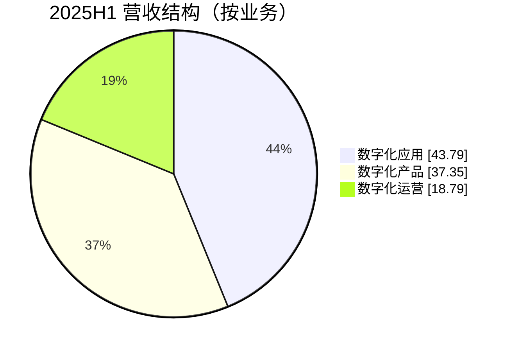
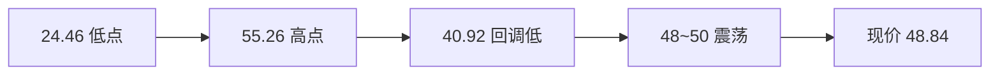

# 20260211 科大国创（SZ300520）深度分析

## 一、业务与竞争格局

### 1.1 业务结构（2025 年上半年）

| 业务 | 营收(亿) | 占比 | 同比变化(三季报) |
|------|----------|------|-------------------|
| 数字化应用 | 2.18 | 43.8% | **-43.63%** |
| 数字化产品 | 1.86 | 37.4% | **+58.50%** |
| 数字化运营 | 0.94 | 18.8% | **-47.06%** |

按行业：**智能汽车约 36%**、电信约 33%、智慧物流约 19%、政企约 10%、能源约 2%。应用与运营两大块下滑，仅数字化产品高增，整体营收 2025 前三季同比 **-24.16%**，利润 **-1.20 亿**（同比 -152%）。

### 1.2 行业位置

- 2025 年上半年营收约 4.98 亿，在计算机/软件类公司中约排 **35 位**；净利润约 -0.64 亿，约排 **90 位**。
- 对比：**中国软件** 2025 三季报营收约 31.98 亿（行业约 18/131），毛利率约 41%，科大国创规模与毛利均弱于龙头。
- 结论：**跟风型标的**，依赖 AI/信创/储能等主题，非板块龙头。

---

## 二、风险深化：应收、诉讼与业绩波动

### 2.1 业绩下修与应收

- **2024 年业绩下修**：从预告盈利 2200 万~3300 万，下修为**亏损 500 万~1000 万**，主因数字物流供应链**个别客户应收在 2025 年 1 月 30 日后逾期，4 月突发诉讼**，公司据此提高坏账计提。
- **减值规模**：2024 年前三季应收账款等合计计提约 **9630 万**减值，其中应收坏账约占 95%，影响净利润约 **7097 万**。
- **诉讼**：连续 12 个月涉案金额合计约 **2.3 亿**，占最近一期净资产约 **12.26%**；多为子公司**慧联运**（智慧物流）相关，前三大案约 6841 万、6396 万、2902 万。

### 2.2 对估值与股价的含义

智慧物流（数字化运营）既拖累营收（-47%），又带来应收与诉讼风险。若再次大额计提或新诉讼披露，易触发业绩与估值双杀。

---

## 三、技术面深化

### 3.1 中期形态（约 88 个交易日）

- **区间**：2025-10-09 ~ 2026-02-11；**最高 55.26**（2026-01-15），**最低 24.46**（2025-10-13）。
- **结构**：自 24.46 起一波上涨至 55.26（约 +126%），随后回调至 40.92（2 月 2 日），再反弹至 48~50 一带，当前处于**前高下方震荡**。

### 3.2 均线与量价

- **最新**：MA5 47.85 > MA10 45.89 > MA20 46.04 > MA60 40.21，短中期仍为多头排列，价格贴近 MA5，上行动能减弱。
- **量价**：2 月 6 日、2 月 9 日放量上涨（23.39 亿、26.90 亿），2 月 10–11 日缩量（18.21 亿、17.26 亿），属**高位缩量震荡**。

### 3.3 关键价位

| 类型 | 价位 | 说明 |
|------|------|------|
| 强压力 | 55.26 | 1 月 15 日前高 |
| 压力 | 50.45 | 5 日高点；50.0 整数关口 |
| 次压力 | 48.8~49.2 | 近期震荡上沿 |
| 当前 | 48.84 | 处于压力区下沿 |
| 支撑 | 47.3~47.9 | 2 月 10–11 下影、MA5 附近 |
| 强支撑 | 43.5~44.0 | 2 月 4–5 平台、MA10 一带 |
| 关键支撑 | 40.92~41.0 | 2 月 2 日低点，跌破则形态转弱 |

### 3.4 资金与筹码

- **当日**：主力净流出约 0.79 亿，小单净流入约 0.73 亿，**主力减、散户接**。
- **换手**：近 5 日总换手约 75%，20 日约 297%，筹码交换充分；若后续量能持续萎缩且无法站稳 50，易形成阶段顶。

### 3.5 近几日走势摘要

| 日期 | 开盘 | 最高 | 最低 | 收盘 | 涨跌幅 | 成交额 |
|------|------|------|------|------|--------|--------|
| 01-30 | 44.89 | 47.30 | 43.73 | 45.27 | +0.85% | 14.50亿 |
| 02-02 | 42.98 | 44.71 | 40.92 | 40.94 | -4.75% | 16.32亿 |
| 02-03 | 41.69 | 44.80 | 41.11 | 44.30 | +6.26% | 15.84亿 |
| 02-04 | 43.66 | 46.38 | 43.20 | 44.32 | +1.51% | 14.02亿 |
| 02-05 | 43.97 | 47.10 | 43.62 | 45.99 | +4.59% | 18.72亿 |
| 02-06 | 45.59 | 49.00 | 45.17 | 46.78 | +2.61% | 23.39亿 |
| 02-09 | 47.71 | 50.44 | 45.70 | 49.18 | +3.08% | 26.90亿 |
| 02-10 | 49.00 | 49.63 | 47.88 | 48.48 | -1.06% | 18.21亿 |
| 02-11 | 48.11 | 49.93 | 47.34 | 48.84 | +1.52% | 17.26亿 |

节奏：急跌（2/2）→ 反包（2/3）→ 上行（2/5–2/9）→ 高位震荡（2/10–2/11）。

---

## 四、结论与操作建议

### 4.1 定性

- **题材**：AI（科创星云、智能体）、信创、储能订单（3.74 亿）、量子（参股国仪量子）等。
- **质地**：营收下滑、亏损扩大、应收与诉讼风险突出，**主题博弈属性强于业绩驱动**。
- **技术**：中期仍为多头结构，但处在前高下方、缩量震荡，主力流出，**短期不宜盲目追高**。

### 4.2 操作建议

| 项目 | 建议 |
|------|------|
| 多空 | 中性偏谨慎，不追涨；若参与仅轻仓博弈。 |
| 买点 | 回调至 46.0~47.0（MA10 附近）或 43.5~44.0 一带且缩量企稳后，再考虑轻仓试多。 |
| 止损 | 跌破 43.5 或单笔亏损 3%~5% 考虑止损；若跌破 40.92，中期转弱，减仓或离场。 |
| 止盈 | 50.0~50.5 第一目标；55.0 一带前高仅适合持仓者分批兑现。 |
| 仓位 | 单票不超过总仓位 20%；总仓位结合大盘。 |
| 周期 | 建议按短线（1~5 日）对待；若大盘或软件/AI 板块转弱，优先离场。 |

### 4.3 风险提示

1. 业绩与应收：2025 年亏损扩大、营收下滑；智慧物流应收与诉讼若再发酵，存在业绩与估值双杀可能。
2. 资金：主力持续净流出、小单承接，若后续量能萎缩且无法突破 50，易形成阶段顶。
3. 技术：处于前高下方震荡，存在技术性回调可能。
4. 质押：大股东质押比例约 28.55%，需关注流动性及减持预期。
5. 主题依赖：估值主要靠 AI/信创/储能/量子等主题，主题退潮时波动会明显加大。

---

**总结**：科大国创近期走势为「急跌—反包—上行—高位震荡」，业务上仅数字化产品有亮点，应用与运营拖累明显，叠加应收与诉讼风险。**维持「观望或极轻仓短线博弈」**，参与需严格止损与仓位控制，关键支撑 46~47、43.5~44，压力 50~50.5。
