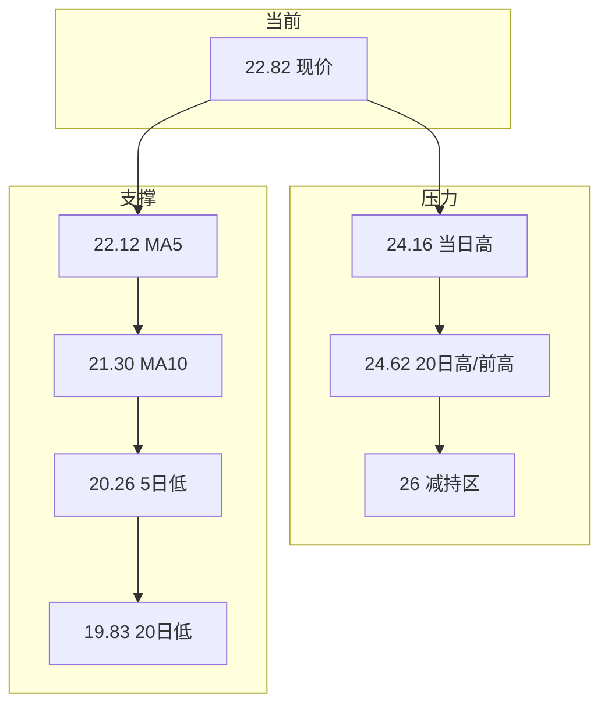
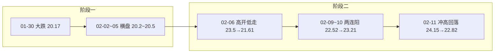

# 20260211 粤万年青（SZ301111）深度分析报告

**分析日期：** 2026年2月11日  
**时间维度：** 短线（1–5日）+ 中线（1–4周）

---

## 一、大盘环境

| 指标 | 状态 |
|------|------|
| 市场特征 | 深证成指 2 月 11 日微跌 0.35%，缩量震荡 |
| 情绪阶段 | 上升期偏分化，热点集中 |
| 市场主线 | AI 应用、传媒、玻璃等；医药/中药非当前主线 |
| 成交与仓位 | 大盘偏暖但缩量，总仓位不宜激进 |

**结论：** 大盘中性偏暖，中药/流感不在主线上，粤万年青缺乏板块共振，更多看个股逻辑与估值修复。

---

## 二、板块定位

**概念归属：** 幽门螺杆菌、新冠治疗、流感（中药/OTC）

| 板块 | 当前状态 |
|------|----------|
| 中药 | 估值处于 2013 年以来偏低区间，基药目录调整、流感 OTC 有预期 |
| 流感/OTC | 流感高峰多在 12 月–1 月，院外流感中成药有季节性 |
| 粤万年青在板块中 | 小市值中药股，非板块龙头，偏跟风/补涨 |

---

## 三、基本面分析

### 3.1 财务概况

| 指标 | 2024年 | 2023年 | 2022年 | 2021年 | 趋势 |
|------|--------|--------|--------|--------|------|
| 营收(亿) | 2.79 | 2.92 | 2.83 | 3.50 | 近年下滑后企稳 |
| 净利润(亿) | 0.04 | 0.34 | 0.33 | 0.57 | 2024 年大幅下滑 |
| 每股收益(元) | 0.03 | 0.21 | 0.21 | 0.48 | 2024 年接近盈亏平衡 |
| ROE(%) | 0.54 | 4.32 | 4.40 | 7.62 | 2024 年显著下降 |

- **2024 年业绩压力：** 营收同比约 -4.71%，归母净利润同比约 -87.57%，扣非净利润约 -653 万元。公司推进「一核多翼」大健康（中药饮片、医疗与健康管理、健康食品等），新业务战略投入拖累业绩约 2000 万元；传统中成药收入约 2.71 亿、同比约 -6.31%，毛利率同比 +1.81%。
- **估值：** 市盈率(静) 877（利润极薄失真），市净率 4.88，总市值约 36–37 亿，小市值。

### 3.2 产品与竞争格局

| 维度 | 内容 |
|------|------|
| 品牌 | “万年青”中华老字号（2024年2月认定），约130年历史 |
| 批文 | 101个国药准字号，11种剂型 |
| 基药/医保 | 16个基药、39个医保；消炎利胆片为基药+医保甲类 |
| 核心品种 | 消炎利胆片（胆道）、脑力宝丸、胆石通胶囊等；胆道/降糖/心脑血管/感冒/补益等品类 |

**结论：** 有品牌和基药背书，但规模小、当前业绩差，估值已部分反映预期，需等业绩或政策催化兑现。

### 3.3 近期事件

- **股东减持：** 合和投资已减持 319 万股（约 1.99%），减持价约 24.97–26.08 元，减持后持股约 5.01%。
- **2026 年关联交易：** 2026 年度日常关联交易预计不超过约 672 万元。
- **战略：** 「一核多翼」— 以万年青老字号中成药为核心，延伸中药饮片、医疗服务与健康管理、健康食品等。

---

## 四、技术面分析

### 4.1 均线与趋势

- **价格与均线（2 月 11 日）：** 现价 22.82，位于 MA5(22.12)、MA10(21.30) 之上，略高于 MA20(21.76)、MA60(21.56)；短期偏多，尚未形成清晰多头排列。
- **压力：** 24.16（当日高）→ 24.62（20 日高）→ 31.36（前高）。**支撑：** MA5 22.12 → MA10 21.30 → 20.26（5 日低）→ 19.83（20 日低）。

### 4.2 技术指标（截至 2026-02-11）

| 指标 | 数值 | 含义 |
|------|------|------|
| KDJ | K 59.15, D 43.67, J 90.11 | J 进入超买区，短线不宜追高 |
| MACD | DIF 0.21, DEA 0.07 | 零轴上方金叉，偏多但力度一般 |
| RSI(6/12/24) | 65 / 58 / 55 | 未严重超买，但有休整空间 |

### 4.3 量价与资金

- **当日：** 主力净流出约 0.22 亿（-7.89%），小单净流入约 0.38 亿（+13.31%）— 主力兑现、散户接盘。
- **5 日：** 涨 +11.53%，近 5 日换手合计约 47%，量价配合一般。

### 4.4 关键价位示意

---

## 五、近 5 个交易日走势

### 5.1 日线概览

| 日期 | 开盘 | 最高 | 最低 | 收盘 | 涨跌幅 | 成交量(万手) | 成交额(亿) | 上午量占比 |
|------|------|------|------|------|--------|--------------|------------|------------|
| 01-30 | 21.29 | 21.30 | 19.89 | 20.17 | -5.26% | 939 | 1.91 | 72% |
| 02-02 | 20.24 | 20.81 | 20.03 | 20.16 | -0.40% | 780 | 1.59 | 67% |
| 02-03 | 20.30 | 20.50 | 20.01 | 20.48 | +0.89% | 534 | 1.08 | 56% |
| 02-04 | 20.36 | 20.95 | 20.23 | 20.51 | +0.74% | 606 | 1.25 | 57% |
| 02-05 | 20.26 | 20.88 | 20.26 | 20.46 | +0.99% | 524 | 1.08 | 63% |
| 02-06 | 23.50 | 23.50 | 21.36 | 21.61 | -8.04% | 2076 | 4.66 | 82% |
| 02-09 | 21.64 | 23.00 | 21.10 | 22.52 | +4.07% | 2079 | 4.58 | 70% |
| 02-10 | 22.31 | 23.83 | 22.31 | 23.21 | +4.03% | 1674 | 3.90 | 71% |
| 02-11 | 23.03 | 24.15 | 22.82 | 22.82 | -0.91% | 1214 | 2.84 | 68% |

### 5.2 走势结构

### 5.3 要点

- **01-30** 放量大跌；**02-02~05** 缩量横盘；**02-06** 大幅高开后低走、上午量占 82%，抛压集中；**02-09~10** 放量两连阳修复；**02-11** 冲高 24.15 后回落，量缩，前高压力显现。

---

## 六、资金与筹码

| 类型 | 情况 |
|------|------|
| 融资 | 2026 年 1 月多日融资买入，单日约 2600 万–7200 万，短线资金参与度高 |
| 当日(2/11) | 主力净流出、小单净流入，拉高后分歧加大 |
| 减持 | 合和投资减持至 5.01%，24–26 元为减持成本区，心理压力明显 |

---

## 七、催化与情景

| 催化 | 内容 |
|------|------|
| 基药目录 | 公司已有 16 个基药；若新版扩容或品种入选，有放量预期（偏中期） |
| 流感/OTC | 流感季对感冒类中成药有季节性拉动 |
| 监管 | 《中药生产监督管理专门规定》2026 年 3 月 1 日起施行，利于合规龙头 |
| 业绩拐点 | “一核多翼”投入若收敛、传统中成药恢复增长，利润有望修复 |

| 情景 | 对股价影响 |
|------|------------|
| 乐观 | 业绩明显改善 + 基药/流感催化，有机会挑战 26–30 元 |
| 中性 | 业绩企稳，20–25 元区间震荡为主 |
| 悲观 | 业绩不及预期或主题退潮，可能回踩 19–21 元 |

---

## 八、结论与操作建议

### 8.1 多空与操作

| 项目 | 结论 |
|------|------|
| **多空判断** | **中性偏谨慎**：有题材但业绩与资金面不支持追高 |
| **操作建议** | **观望为主**；若已有仓位可持有但不加仓；未持仓者不追高 |
| **时间维度** | 短线震荡；中线观察业绩与是否放量突破压力带 |

### 8.2 价位与仓位

- **潜在买点：** 回调至 **21.0–21.5**（MA10 一带）且缩量企稳，或 **放量站稳 24.6** 后再考虑轻仓试多。
- **止损参考：** 跌破 **20.0–20.3**（20 日低且放量）或单笔亏损 3–5%。
- **仓位建议：** 单票不超过总仓位 **20%**；当前更宜观望或极小仓。

### 8.3 风险提示

1. **业绩风险：** 2024 年利润骤降、扣非亏损，若 2025–2026 年改善不及预期，估值会再承压。
2. **减持与压力：** 24–26 元为减持与前高密集区，突破前易反复。
3. **资金性质：** 融资+游资主导，波动大。
4. **题材依赖：** 流感/基药主题退潮时波动会放大。

---

**总结：** 粤万年青有品牌和题材，但业绩与资金面不支持当前价位追高；更适合在回调或出现业绩/基药等实质催化后再择机小仓位参与，并设好止损。数据与分时脚本见 `script/fetch_sz301111_5day.py`。
