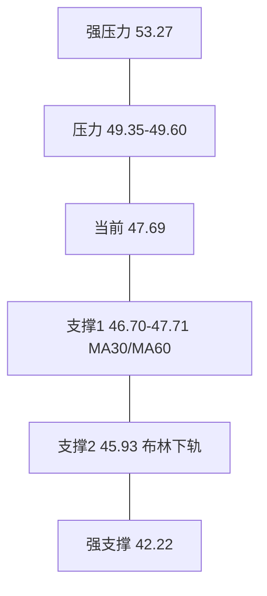
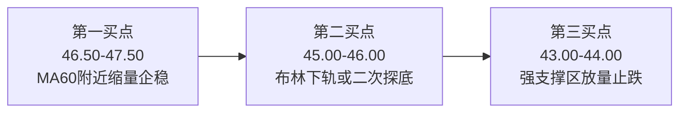

# 金银河（SZ300619）深度分析报告

**分析日期：** 2026年2月11日  
**时间维度：** 短线 + 中期持股策略

---

## 一、大盘环境

| 指标 | 状态 |
|------|------|
| 市场特征 | 缩量盘整，局部热点活跃 |
| 涨停/跌停 | 2月9日涨停83家、跌停仅3家 |
| 赚钱效应 | 86.7%（强势） |
| 连板高度 | 4板（协鑫集成领涨） |
| 市场主线 | Seedance概念/AI应用、玻璃玻纤、影视传媒 |
| 情绪阶段 | 上升期偏高潮 — 赚钱效应好但分化显现 |

**结论：** 大盘偏暖，但成交缩量；热点在AI/传媒，金银河所属新能源设备不在主线上，缺乏板块共振。

---

## 二、板块定位

**概念归属：** 新能源汽车、有机硅、钠离子电池、锂电池、高端装备

| 板块 | 当前状态 |
|------|---------|
| 有机硅 | 底部恢复期，供给扩张尾声，景气待回升 |
| 锂电设备 | 行业增速放缓，固态/钠电有预期 |
| 钠离子电池 | 概念预期阶段，产业化尚早 |

**地位：** 锂电池浆料双螺杆设备市占率超95%，细分隐形冠军，非板块总龙头。

---

## 三、基本面分析

### 3.1 财务概况

| 指标 | 2024年 | 2023年 | 变化 |
|------|--------|--------|------|
| 营收(亿) | 15.09 | 22.52 | -33% |
| 净利润(亿) | -0.81 | 0.94 | 转亏 |
| 每股收益 | -0.60 | 1.05 | 恶化 |
| ROE | -5.19% | 5.62% | 转负 |

### 3.2 2025年拐点信号

| 指标 | 2025H1/前三季 | 同比 |
|------|----------------|------|
| 营收(前三季) | 13.71亿 | +7.33% |
| 净利润(前三季) | 0.12亿 | +220.37% |
| 营收(上半年) | 7.11亿 | +49.57% |

### 3.3 估值与业务亮点

| 指标 | 数值 | 评价 |
|------|------|------|
| 市盈率(静) | -102.81 | 亏损期无参考 |
| 市净率 | 5.26 | 偏高，已含成长预期 |
| 总市值 | ≈83亿 | 中等偏小 |

**业务亮点：** 锂电浆料设备市占率95%+；固态电池干法成膜设备（黄金龙）；钠电池整线；锂云母提锂（金德锂投产，2026年碳酸锂目标6500吨）。

---

## 四、技术面分析

### 4.1 均线与趋势

- 当前价 47.69 跌破 MA5(49.35)/MA10(49.37)/MA20，短期空头排列。
- 在 MA30(47.71) 附近获支撑，MA60(46.70) 为下一档支撑。
- MA60、MA120 仍多头排列，中期趋势未破坏。

### 4.2 技术指标（2026-02-11）

| 指标 | 数值 | 信号 |
|------|------|------|
| MACD DIF/DEA | 0.82 / 1.12 | 死叉形成中 |
| RSI(6)/(12) | 42.00 / 47.89 | 中性偏弱 |
| KDJ-J | 17.57 | 超卖 |
| 布林下轨 | 45.93 | 支撑参考 |

### 4.3 关键价位

### 4.4 近5日量价要点

- **2月6日：** 放量拉升 48→52，主力行为。
- **2月9日：** 高开52.80 后缓跌，冲高回落。
- **2月10日：** 放量暴跌（7.79亿），51.45→47.18，早盘集中抛售，出货形态。
- **2月11日：** 缩量弱反弹 +1.08%，资金观望。

### 4.5 资金流向（2月11日）

主力 +0.03亿、超大单 +0.12亿、大单 -0.09亿，整体无明显主力介入。

---

## 五、中期持股操作策略

**中期定义：** 1～4 周至 2～3 个月，以趋势与关键价位为主，不频繁交易。

### 5.1 多空与仓位原则

| 维度 | 建议 |
|------|------|
| 多空 | 中期偏多（基本面拐点+细分龙头），短期以观望/分批为主 |
| 总仓位 | 单只不超过总仓位 20～30%，大盘正常时可取中位数 |
| 建仓方式 | 不一次性重仓，分 2～3 批在支撑位企稳后介入 |

### 5.2 买点与分批计划

| 批次 | 价位区间 | 条件 |
|------|----------|------|
| 第一批 | 46.50～47.50 | 回调至 MA60 附近，出现缩量小阴小阳或止跌阳线，不创新低 |
| 第二批 | 45.00～46.00 | 若继续回调至布林下轨或前低附近，再次缩量企稳或放量反包 |
| 第三批 | 43.00～44.00 | 若出现恐慌杀跌至 20 日最低区（约 42.22），放量止跌可考虑加仓 |

**不追高：** 未出现上述企稳信号前，不在 49 元上方加仓。

### 5.3 止损与持仓纪律

| 情形 | 操作 |
|------|------|
| 技术止损 | 有效跌破 **45.00**（整数关+布林下轨下方）考虑减仓或止损 |
| 幅度止损 | 单笔亏损达 **8%～10%** 无条件止损 |
| 趋势止损 | 若 MA60 下穿 MA120 或周线明显转空，降低仓位或离场 |
| 基本面恶化 | 若 2025 年报或 2026 一季报业绩大幅低于预期，重新评估并减仓 |

### 5.4 止盈与目标

| 目标 | 价位/条件 | 操作建议 |
|------|-----------|----------|
| 第一目标 | 49.50～50.50（MA5/MA10 区） | 可减仓 1/3，锁定部分利润 |
| 第二目标 | 52.00～53.00（前震荡区） | 再减 1/3，保留底仓 |
| 第三目标 | 55.00～57.00（前高区） | 视量能决定是否清仓或留极小仓位博弈 |

**持有期催化剂关注：** 2025 年年报、2026 一季报、固态/钠电订单或政策、有机硅/锂电板块轮动。

### 5.5 中期持股时间与再评估

| 时间 | 动作 |
|------|------|
| 1～2 周 | 观察 46～48 区间是否企稳，决定是否执行第一批建仓 |
| 1 个月 | 根据是否触及止损/止盈，评估仓位与成本 |
| 2～3 个月 | 结合季报与板块表现，决定继续持有、加仓或退出 |

### 5.6 风险提示（中期）

1. 2024 年亏损，若 2025 年报或 2026 一季报不及预期，存在杀估值风险（当前 PB 5.26）。
2. 短期刚经历放量暴跌，不排除二次探底，不宜在未企稳时重仓。
3. 板块不在当前主线，反弹高度可能受限，需降低预期。
4. 股权激励授予价 29.47 元，仅作参考，不作为强支撑依据。

---

## 六、结论汇总

| 项目 | 结论 |
|------|------|
| 多空判断 | 短期偏空/观望；中期偏多，等企稳后分批布局 |
| 操作建议 | 观望 → 支撑位企稳后分批买；已有仓可持有但设好止损，反弹至压力位分批减 |
| 关键价位 | 支撑 46.70 / 45.93 / 42.22；压力 49.35 / 52～57 |
| 仓位 | 单只 ≤ 20～30%，分批建仓 |
| 时间维度 | 短线 1～5 日观望；中期 1～4 周至 2～3 月按上述策略执行 |

**一句话：** 金银河具备细分龙头与业绩拐点逻辑，适合中期持有，但应在支撑位企稳后分批介入并严守止损，避免在放量暴跌后盲目抄底。
